# 、阿里云SLS与腾讯云CLS功能点列表

## 1.阿里云SLS

### 1.1LogHub：采集与实时消费

**功能：**

- 通过ECS、容器、移动端，开源软件，JS等接入实时日志数据（例如Metric、Event、BinLog、TextLog、Click等）
- 提供实时消费接口，与实时计算及服务对接

**用途**：

​		数据清洗（ETL）、流计算（Stream Compute）、监控与报警、 机器学习与迭代计算。

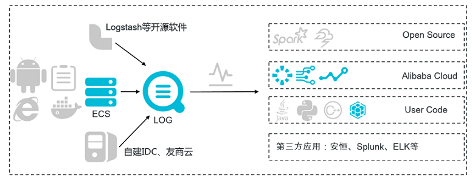

#### 1.1.1数据清洗(ETL)

##### **支持场景**

######  数据规整（一对一）

**对数据进行规范化、富化、重索引等：**

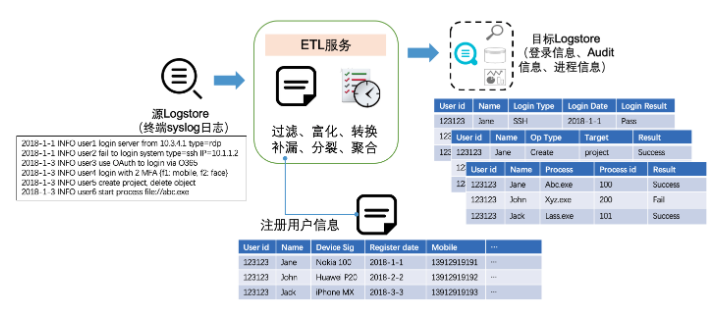

######  数据分派（一对多）

**对数据进行规整后做动态分发**

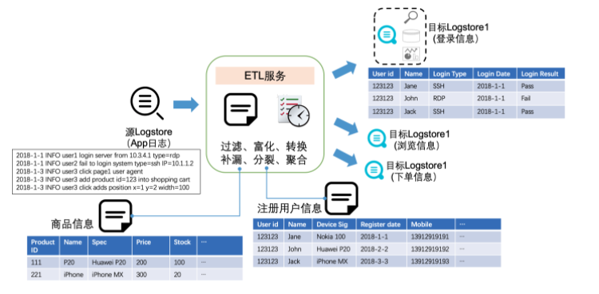

###### 多源汇集（多对一）

**支持跨账号同Region下操作数据，并汇总数据**

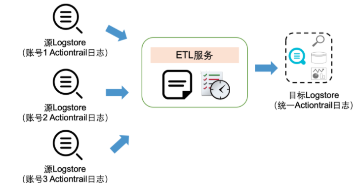

###### 常规数据加工场景

全面覆盖数据加工的典型模式，包括过滤、分裂、转换、富化等。

提供了200多个内置高阶函数以及400多个正则表达式模式，不需要写代码即可完成大部分的数据加工任务，同时提供灵活自定义函数(UDF)的能力，满足各种场景

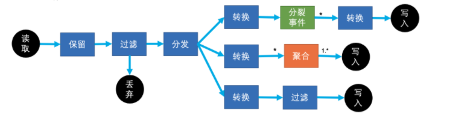

- 过滤（filter）：将特定的日志去掉
- 分裂（split）：将一条日志变成多条
- 转换（transform）：字段操作、内容转换等
- 富化（enrich）：关联外部资源，丰富字段信息等
- 聚合（Rollup）（待上线）：特定维度做聚集，减少日志量
- 自定义操作（待上线）：以上自定义操作，如SQL模式解析、自定义Agg操作等


#### 1.1.2流计算（Stream Compute）

​		日志服务集成 Spark 流式计算：使用Spark Streaming和Structured Streaming对采集到日志服务中的数据进行消费，计算并将结果写回到日志服务。


#### **1.1.3监控与报警**

​		**监控Loghub采集到的的日志，根据自定义监控指指标设置报警规则、定义图表展示。**

1. 业务日志统计与监控报警
2. 日志关键字监控与报警
3. 网站访问日志数据统计与报警


### 1.2 查询与实时分析（LogSearch/Analytics）

​		实时索引、查询分析数据。

**功能：**

- 查询：关键词查询、模糊查询、上下文查询、精确查询。
- 统计：SQL聚合等丰富的统计手段。
- 可视化：仪表盘和报表功能。
- 对接：支持基于JDBC、SQL92等协议与Grafana产品无缝对接。

**用途**：

DevOps线上运维、日志实时数据分析、安全诊断与分析、运营与客服系统。

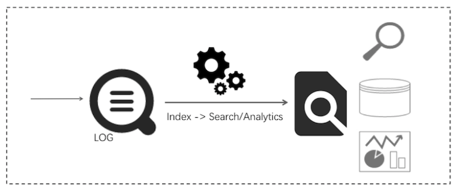

**功能优势：**

- 实时：采集到的日志被实时分析。
- 快速：
  - 查询：一秒内查询（5个条件），可处理10亿级数据。
  - 分析：一秒内分析（5个维度聚合+GroupBy），可聚合亿级别数据。
- 灵活：可以任意改变查询和分析条件，实时获取结果。
- 生态丰富：除控制台提供的报表、仪表盘、快速分析等功能外，还可以与Grafana、DataV、Jaeger等产品无缝对接，并支持Restful API、JDBC等协议。


### 1.3 投递数仓（LogShipper）

​		稳定可靠的日志投递。将日志中枢数据投递至存储类服务进行存储。支持压缩、自定义Partition、以及行列等各种存储方式。将采集到的日志通过控制台进行投递，便于您长期存储数据或联合其它系统（如E-MapReduce）消费数据。一旦启用日志投递功能，日志服务定时将采集到的日志投递到对应云产品中。

**用途**：数据仓库、数据分析、审计、推荐系统与用户画像。

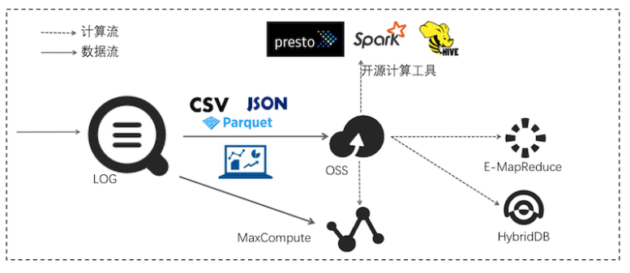


## 2.腾讯云CLS

### 2.1 日志采集

**通过LogListener、API等方式从不同日志采集端采集日志至日志服务**

| 采集方式               | 描述                                                         |
| ---------------------- | ------------------------------------------------------------ |
| API 方式采集           | 通过调用 [日志服务 API](https://cloud.tencent.com/document/product/614/12445) 上传结构化日志至日志服务，日志上传参考 [上传日志接口](https://cloud.tencent.com/document/product/614/16873) 文档 |
| SDK 方式采集           | 暂无 SDK 提供                                                |
| LogListener 客户端采集 | LogListener 是日志服务提供的日志采集客户端，通过控制台简单配置可快速接入日志服务，使用方式参考 [LogListener 使用流程](https://cloud.tencent.com/document/product/614/33495) |


### 2.2 日志检索

​		日志检索是根据日志内容的关键词进行检索，将日志内容的关键词和用户输入的信息进行匹配。其中用户可根据自己业务场景具体需求，通过自定义分词符和选择大小写是否敏感灵活调整关键词。

​		支持全文检索、关键词检索、跨主题查询等功能

### 2.3 日志投递

​		日志服务可以将日志主题中的数据投递到 COS，以满足其他应用场景需求。例如：

- 通过设置对象存储 COS 的生命周期，对日志数据进行长时间的归档存储。
- 通过离线计算或其他计算程序处理 COS 上的日志数据。

| 投递数据格式     | 描述说明                                 |
| ---------------- | ---------------------------------------- |
| 按分隔符格式投递 | 日志数据按照分隔符格式投递到对象存储 COS |
| 按JSON格式投递   | 日志数据按照 JSON 格式投递到对象存储 COS |
| 按原文格式投递   | 日志数据按照原文格式投递到对象存储 COS   |

 


## 3.功能列表

### 3.1 数据采集

#### 3.1.2  采集类型

| 类别     | 阿里云SLS            | 介入方式                                     | 类别 | 腾讯云CLS    | 介入方式    |
| -------- | -------------------- | -------------------------------------------- | ---- | ------------ | ----------- |
| 应用     | 程序输出             | Logtail                                      | 应用 | 程序直接输出 | API         |
|          | 访问日志             | Logtail                                      |      | 本地日志文件 | LogListener |
|          | 链路跟踪             | Jaeger Collector，Logtail                    |      |              |             |
| 语言     | Java                 | Log Service Java SDK，Java Producer Library  |      |              |             |
|          | Log4J Appender       | 1.x，2.x                                     |      |              |             |
|          | LogBack Appender     | LogBack                                      |      |              |             |
|          | C                    | Log Service C SDK                            |      |              |             |
|          | Python               | Log Service Python SDK                       |      |              |             |
|          | Python Logging       | Python Logging Handler                       |      |              |             |
|          | PHP                  | Log Service PHP SDK                          |      |              |             |
|          | .Net                 | Log Service csharp SDK                       |      |              |             |
|          | C++                  | Log Service C++ SDK                          |      |              |             |
|          | Go                   | Log Service Go SDK，Golang Producer Library  |      |              |             |
|          | NodeJS               | NodeJs                                       |      |              |             |
|          | JS                   | JS/Web Tracking                              |      |              |             |
| 操作系统 | Linux                | Logtail                                      |      |              |             |
|          | Windows              | Logtail                                      |      |              |             |
|          | Mac/Unix             | Native C                                     |      |              |             |
|          | Docker文件           | Logtail 文件采集                             |      |              |             |
|          | Docker输出           | Logtail 容器输出                             |      |              |             |
| 数据库   | Mysql Binlog         | 采集MySQL Binlog                             |      |              |             |
|          | JDBC Select          | 采集MySQL查询结果                            |      |              |             |
| 移动端   | IOS/Android          | Log Service Android SDK，Log Service iOS SDK |      |              |             |
|          | 网页                 | JS/Web Tracking                              |      |              |             |
|          | 只能IoT              | C Producer Library                           |      |              |             |
|          | Http轮训             | Logtail HTTP                                 |      |              |             |
|          | Syslog               | Logtail插件-syslog输入源                     |      |              |             |
| 数据导入 | MaxCompute数据       | 导入MaxCompute数据                           |      |              |             |
|          | OSS数据              | 导入OSS数据                                  |      |              |             |
|          | Flink                | 通过Fink写入数据                             |      |              |             |
| 第三方   | Logstash             | Logstash                                     |      |              |             |
|          | Flume                | Flume消费                                    |      |              |             |
| 云产品   | ECS、OSS等云产品日志 | 云产品日志采集                               |      |              |             |


#### 3.1.3  采集配置

| 阿里云SLS          | 腾讯云CLS  |
| ------------------ | ---------- |
| 日志路径           | 采集路径   |
| 设置采集黑名单     | 选择机器组 |
| 是否为Docker文件   |            |
| 解析模式           |            |
| 丢弃解析失败的日志 |            |
| 最大监控目录深度   |            |
| 启动插件处理       |            |
| 上传原始日志       |            |
| Topic生成方式      |            |
| 日志文件编码       |            |
| 时区属性           |            |
| 超时属性           |            |
| 过滤器配置         |            |

**阿里云SLS采集配置**


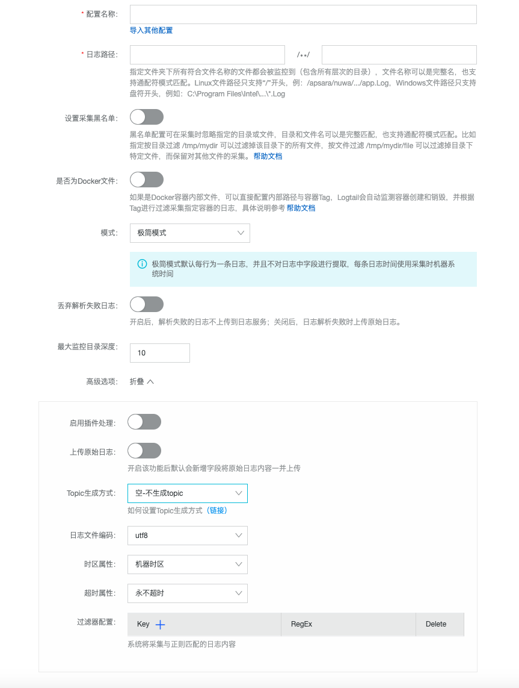


**腾讯云CLS采集配置**

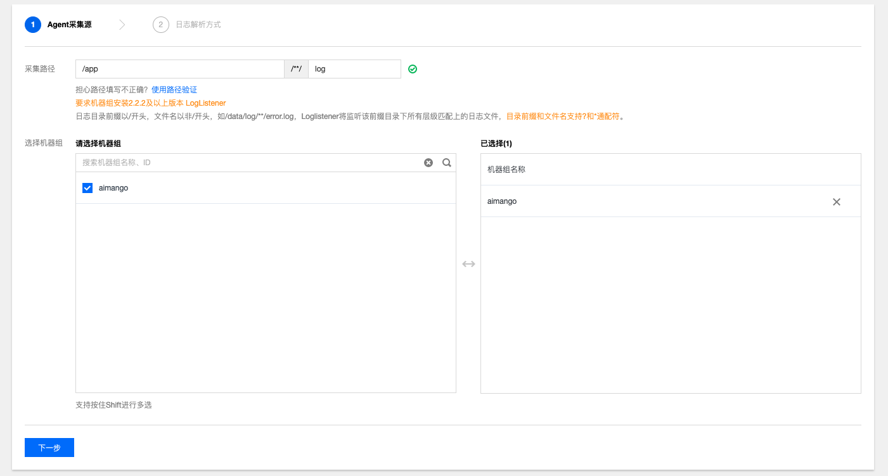


#### 3.1.4 数据解析模式

| 阿里云SLS      | 腾讯云CLS     |
| -------------- | ------------- |
| Nginx配置模式  | 单行全文模式  |
| IIS配置模式    | JSON模式      |
| Apache配置模式 | 分隔符模式    |
| 极简模式       | 多行全文模式  |
| 极简模式-多行  | 完全正则模式  |
| SON模式        | Nginx日志模板 |
| 分隔符模式     |               |
| 完整正则模式   |               |

**阿里云SLS**

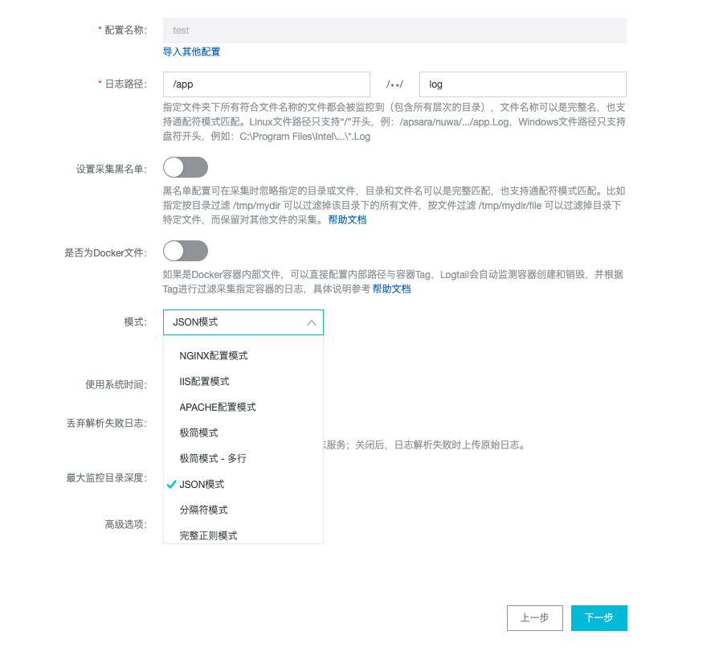

**腾讯云CLS**

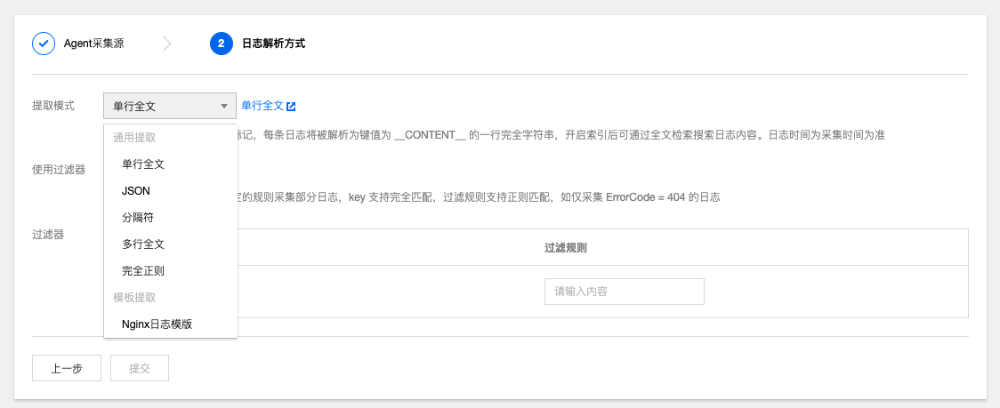


#### 3.1.5 索引配置

| 阿里云SLS    | 腾讯云CLS  |
| ------------ | ---------- |
| 全文索引     | 全文索引   |
| 包含中文     | 大小写敏感 |
| 大小写敏感   | 全文分词符 |
| 分词符       | 键值索引   |
| 指定字段查询 | 源数据索引 |

**阿里云SLS**

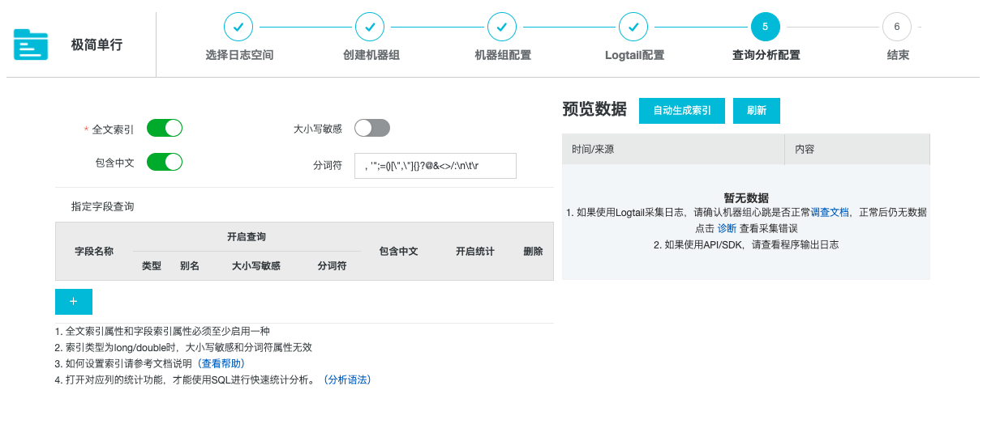


**腾讯云CLS**

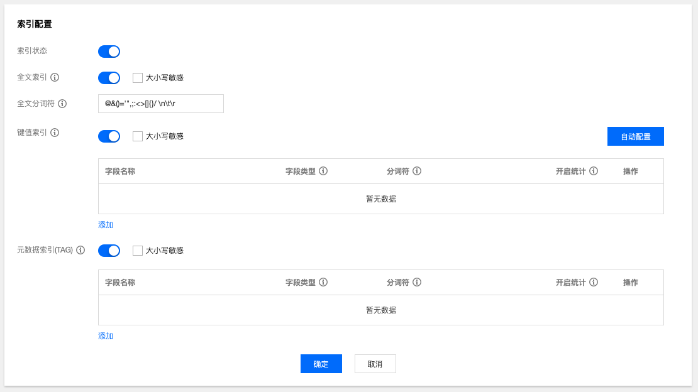


### 3.2 查询与分析

#### 3.2.1 查询模式

| 阿里云SLS          | 腾讯云CLS          |
| ------------------ | ------------------ |
| 全文查询           | 全文检索           |
| 普通全文查询       | 模糊检索           |
| 短语查询           | 键值检索           |
| 关键词查询         | 范围检索           |
| 模糊查询           | 组合检索           |
| 上下文查询         | 元数据检索         |
| 精确查询           | 多级JSON检索       |
| 数值查询           | 自定义分析语句查询 |
| 数值范围查询       |                    |
| 组合条件查询       |                    |
| 自定义分析语句查询 |                    |

**阿里云SLS分析效果展示**

**根据自定义的分析语句进行查询，如图所示**

```sql
status>200 |select avg(latency),max(latency),count(1) as c GROUP BY  method  ORDER BY c DESC  LIMIT 20
```

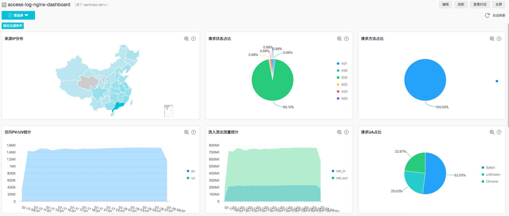

**支持的SQL语法**

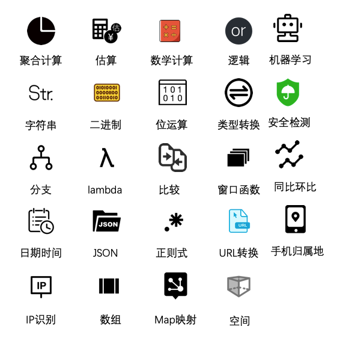


**腾讯云CLS**

```SQL
无检索条件，计算访问次数 PV 值
* | select count(*) as pv
```

- SQL 语句目前支持 `select`，`as`，`group by`，`order by`，`limit`，`where` 语法，详细可见 [SQL 语法](https://cloud.tencent.com/document/product/614/44061#sql1)。


#### 3.2.2 日志面板

| 阿里云SLS      | 腾讯云CLS      |
| -------------- | -------------- |
| 日志数量统计图 | 日志数量统计图 |
| 按时间范围查询 | 图表分析       |
| 自动刷新       | 按时间范围查询 |
| 统计图表       | 自动刷新       |
| 日志聚类       |                |

**阿里云SLS**

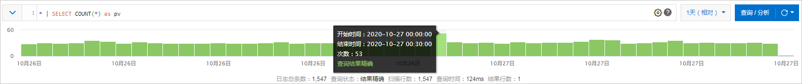

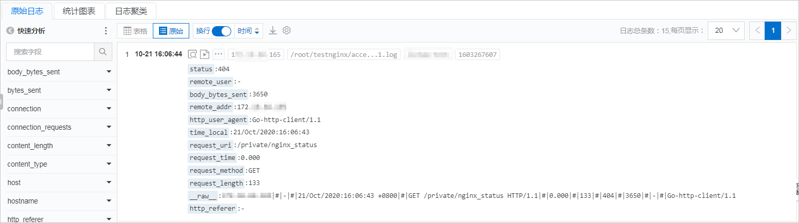


**腾讯云CLS**

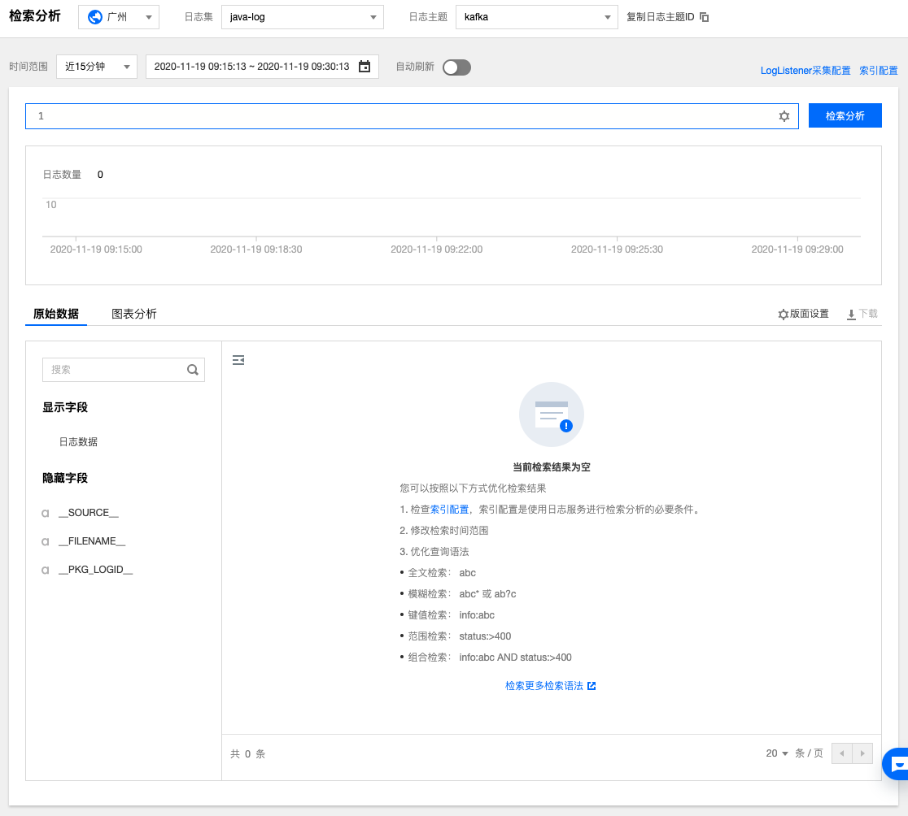


#### 3.2.3 其他功能

| 阿里云SLS  | 腾讯云CLS    |
| ---------- | ------------ |
| 实时分析   | 实时分析     |
| 下载日志   | 下载检索结果 |
| 数据加工   | 数据可视化   |
| 监控告警   |              |
| 数据可视化 |              |
| 实时消费   |              |


### 3.3 日志投递

#### 3.3.1 投递模式

| 阿里云SLS   | 数据格式    | 腾讯云CLS     | 数据格式   |
| ----------- | ----------- | ------------- | ---------- |
| OSS         | JSON格式    | COS（OSS）    | 分隔符模式 |
|             | CSV格式     |               | JSON格式   |
|             | Parquet格式 |               | 原文格式   |
| MaxComputer |             | Ckafka(Kafka) |            |
| AnalyticDB  |             |               |            |
| TSDB        |             |               |            |
| SIEM        |             |               |            |
| TableStore  |             |               |            |

