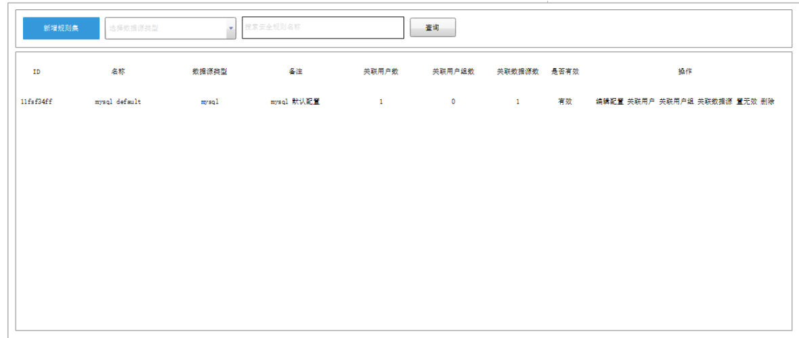
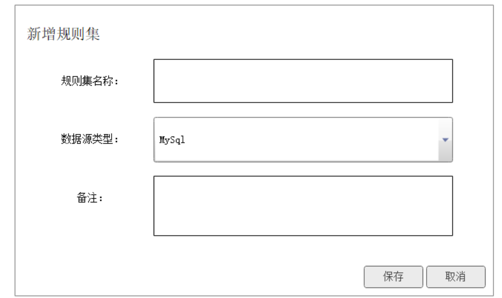
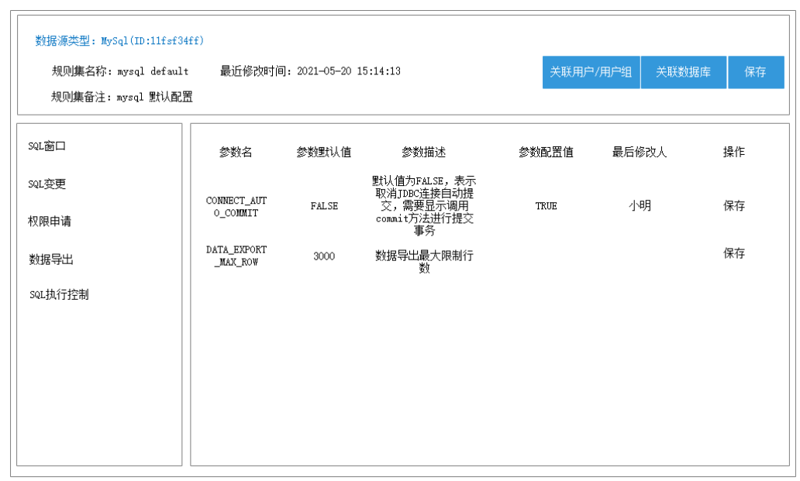

[toc]

## 配置管控功能详细设计文档

### 需求

目前数据库运维平台只有权限管控的功能模块，无法满足针对用户或者数据源进行个性化配置的需求，比如，限制查询行数，限制是否允许导出，数据源只允许只读操作等一系列配置参数设置。

在以前针对这类似的需求我们统一通过字典来设置，但是字典无法灵活的对单个数据源或者单个用户来设置，这里我们就需要进行一个配置管理功能的设计开发来实现了

### 需求分析

结合需求以及未来预估会持续增加不一样的个性化参数配置，需要单独设计一套进行参数配置的配置管控功能来满足。

首先需要有默认的配置来支持系统运行的处理，针对每一种数据库类型来定义，灵活满足以后的参数变动；目前支持的数据库类型有：mysql、orcale、sqlserver；

然后需要再支持用户进行个性化的参数配置，支持当前设置的参数对不同用户、不同用户组、不同数据源进行绑定生效；

 

### 概要设计

满足以后的扩展，针对这类型的参数配置，统一定义为规则集，系统有默认的规则集；用户可以维护不同的规则集绑定不同的用户、不同的用户组、不同的数据源对象。

#### 默认规则集 - 默认的参数

平台默认定义好每一种数据库类型的参数信息，默认的定义参数优先级最低，只有在用户没有自定义参数的时候生效。

默认的参数自动和数据库类型绑定，规则集必要的绑定对象就是数据库类型，其次才是不同的用户、用户组、数据源对象

#### 新增规则集 - 个性化参数信息

支持用户新增规则集

新增的规则集参数都来源于默认定义好的配置参数信息，用户只能修改定义好的配置信息的参数值；

> 比如：
>
> 默认mysql类型的规则集，定义了一个查询最大值的参数配置：mysql-query-limit：10000条记录，那么用户新增的规则集，默认就有这个参数，用户可以将10000这个参数值修改成1000或者999999，但是不能对修改的配置编码mysql-query-limit；同时也不能新增其他的配置参数值。

为了更好的维护参数信息，规则集信息于对应的参数信息是分开两步进行处理的；

**第一步：**

+ 首先创建规则集，定义好规则集的名称、选择所属的数据库类型等
+ 然后再绑定当前规则集的用户对象、用户组对象、数据源对象

**第二步：**

+ 定义好规则集之后，会根据规则集选择数据库类型，自动生成对应类型的默认参数

  > 注：这里生成的默认参数只有界面看到，其实数据库是没有的，数据库查询的是默认配置；用户自己配置之后才会保存到数据库，界面显示的是用户配置的与系统的默认配置

规则集的新增与参数的配置是两个步骤，考虑用户的友好操作性，平台新增的规则集维护好参数之后点击保存就自动生效；

**那么新增的规则集如何确保优先级，如何保存配置唯一性？**

上面提到了默认规则集、用户新增规则集，这两点还是比较明确，用户新增的规则集肯定是要高于默认的规则集的；

对于单独绑定用户或者单独绑定数据源对象的规则优先级也高于绑定全部或者绑定用户组的规则集，总结来说绑定对象的颗粒度越小，优先级越高。

然后再来细分一下新增的规则集，新增的规则支持绑定不同用户、用户组、数据源对象；为了确保配置的唯一性，在新增规则集绑定对象的时候，就需要做效验，判断同一种数据库类型的规则集不允许绑定相同组合的对象；

效验规则说明：

+ 相同数据库类型的规则集，不能绑定用户与数据源相同组合关系的对象，包含全部概念

  > 比如：mysql类型的规则集，绑定了A用户、db1数据源，那么下次新增mysql类型的规则集就不能绑定A用户与db1数据源组合对象

+ 相同数据库类型的规则集，不能绑定用户组与数据源相同组合关系的对象，包含全部概念

+ 用户与用户组都可以绑定，两者不冲突；它们之和数据源有组合关系

+ 每一个新增的规则集必需绑定用户或者用户组、数据源对象，才能点击生效

#### 规则保存处理

整个配置管理模块大致会设计四张表，详细的见最后的表结构设计

+ dms_s_database_rule_config_default：数据库规则集默认配置表
+ dms_s_database_rule：数据库规则集表
+ dms_s_database_rule_config_define：数据库规则集自定义配置表
+ dms_s_database_rule_bind：数据库规则集绑定关系表

在新增规则集的时候有两个步骤，一个是规则集的基本信息，另外一个是规则集的绑定对象；这里分别就保存到数据库规则集表 与  数据库规则集绑定关系表中

新增好规则集之后，系统跳转到维护参数的界面，界面查询的是对应数据库类型的默认配置信息，只不过界面支持用户修改配置的参数值；

用户维护好自己需要修改的参数值之后，统一点击保存，系统自动保存用户变更了默认值的参数；只有用户变更了默认值的数据，才需要进行保存，保存到数据库规则集自定义配置表，否则无需保存到数据库。

#### 规则缓存设计

保存好规则集之后，点击生效之后，系统自动将配置信息写入缓存

缓存有两大块的内容，一个是规则集ID 与 对应配置参数信息，另一个是 用户编码+数据源实例ID+数据库编码三者组合 与 规则集ID；

缓存的地方统一封装服务类 ，引入spring cache来处理，使用Cacheable注解定义；缓存统一设置有效期有60S。

使用spring cache的机制处理，就没有下面的缓存结构了

**规则集ID与对应的参数信息 的 缓存结构** 

>缓存结构：HASH
>
>缓存key：DMS_DATABASE_RULEID_规则集ID
>
>缓存field：参数key
>
>缓存value：配置value
>
>有效期：60秒，60s过期不存在则从数据库中读取并且保存到缓存

**用户编码+数据源实例ID+数据库编码三者组合 与 规则集ID 的 缓存结构** 

>缓存结构：SET
>
>缓存key：DMS_DATABASE_RULE_RELATION_用户编码+数据源实例ID+数据库编码
>
>缓存field：规则集ID
>
>有效期：60秒，60s过期不存在则从数据库中读取并且保存到缓存
>
>

#### 规则生效，用户获取规则处理设计

首先通过用户编码+数据源实例ID+数据库编码三者组合 获取规则集的ID

+ 编写一个统一的方法，这里面来定义规则集的优先级处理，优先级的处理就不细说了，简单来说就是先精准获取再模糊匹配

然后再根据规则集ID、参数KEY来获取对应的参数值，如果规则集或者参数的key获取不到，被删除的情况下，就默认获取平台的默认参数值。

### 表结构设计

dms_s_database_rule：数据库规则集表

| 字段名      | 数据类型     | 主键 | 非空 | 注释                                                     |
| ----------- | ------------ | ---- | ---- | -------------------------------------------------------- |
| id          | varchar(64)  | √    | √    | 数据库规则集表主键，取UUID                               |
| rule_name   | varchar(256) |      | √    | 规则集名称                                               |
| db_type     | char(2)      |      | √    | 数据源类型，0 MySQL、1 PostgreSQL、2 SQLServer，3 Oracle |
| rule_type   | char(1)      |      | √    | 规则类型，0 系统定义，1 自定义                           |
| remarks     | longtext     |      | √    | 备注信息                                                 |
| valid_flag  | char(1)      |      | √    | 有效标志，0 无效，1 有效                                 |
| create_time | datetime     |      | √    | 创建时间                                                 |
| update_time | datetime     |      | √    | 更新时间                                                 |
| user_code   | varchar(64)  |      |      | 创建的用户编码，系统定义的默认为空                       |

dms_s_database_rule_config_default：数据库规则集默认配置表

| 字段名               | 数据类型     | 主键 | 非空 | 注释                               |
| -------------------- | ------------ | ---- | ---- | ---------------------------------- |
| id                   | varchar(64)  | √    | √    | 数据库规则集配置详情表主键，取UUID |
| database_rule_id     | varchar(64)  |      | √    | 数据库规则集表主键                 |
| config_type          | varchar(64)  |      | √    | 配置参数类型，由字典维护           |
| config_key           | varchar(256) |      | √    | 配置参数key                        |
| config_default_value | longtext     |      | √    | 配置参数默认值                     |
| config_describe      | longtext     |      | √    | 配置描述                           |
| create_time          | datetime     |      | √    | 创建时间                           |

注：规则集主键、参数key为唯一键

dms_s_database_rule_config_define：数据库规则集自定义配置表

| 字段名              | 数据类型     | 主键 | 非空 | 注释                               |
| ------------------- | ------------ | ---- | ---- | ---------------------------------- |
| id                  | varchar(64)  | √    | √    | 数据库规则集配置详情表主键，取UUID |
| database_rule_id    | varchar(64)  |      | √    | 数据库规则集配置表主键             |
| config_key          | varchar(256) |      | √    | 配置参数key                        |
| config_define_value | longtext     |      | √    | 配置参数自定义值                   |
| user_code           | varchar(64)  |      | √    | 最后更新用户编码                   |
| create_time         | datetime     |      | √    | 创建时间                           |
| update_time         | datetime     |      | √    | 更新时间                           |

注：规则集主键、参数key为唯一键

dms_s_database_rule_bind：数据库规则集绑定关系表（这个关系是绑定多条）

| 字段名               | 数据类型    | 主键 | 非空 | 注释                                    |
| -------------------- | ----------- | ---- | ---- | --------------------------------------- |
| id                   | varchar(64) | √    | √    | 数据库规则集绑定关系表主键，取UUID      |
| database_rule_set_id | varchar(64) |      | √    | 数据库规则集表主键                      |
| user_code            | longtext    |      |      | 用户编码，多个逗号分隔                  |
| user_group_code      | longtext    |      |      | 用户组编码，多个逗号分隔                |
| datasource_id        | longtext    |      |      | 实例id，多个逗号分隔                    |
| database_code        | longtext    |      |      | 数据库编码，多个逗号分隔：hygeia,pcloud |
| create_time          | datetime    |      | √    | 创建时间                                |
| update_time          | datetime    |      | √    | 更新时间                                |

### 界面原型设计

![image-20220209081339967](配置管控功能详细设计文档.assets/image-20220209081339967.png

### 历史设计

**功能点设计**

- 新增配置集
- 自定义配置集配置详情
- 配置集绑定用户
- 配置集绑定用户组
- 配置集绑定数据源

**处理流程设计**

- 【用户编码 + 数据源ID + 数据库名称】三者组合只能绑定一个自定义配置集

- 配置集缓存一份到缓存中，程序优先从缓存中获取，无法获取时再查询数据库，自定义配置优先级高于默认配置集

  

**详细设计**

**缓存设计**

使用两个缓存保存配置信息，自定义配置信息：DMS_DATABASE_RULE_SET_CUSTOM，系统默认的配置信息：DMS_DATABASE_RULE_SET_DEFAULT，自定义的配置信息缓存设置60秒的有效期，失效后重新获取设置。如果自定义配置项没有绑定用户、用户组、数据库，那么对应的key组成元素为 *，例如：某条配置规则只绑定了用户，那么配置信息的组成key为：USER_用户编码\_\*\_参数key。

> 缓存结构：HASH
>
> 缓存key：DMS_DATABASE_RULE_SET_CUSTOM
>
> 缓存field：USER\_用户编码_数据源ID\_数据库名称\_参数key
>
> 缓存value：配置value
>
> 缓存field：USERGROUP\_用户组编码_数据源ID\_数据库名称\_参数key
>
> 缓存value：配置value
>
> 缓存field：数据源类型_参数key\_DEFAULT
>
> 缓存value：配置value
>
> 
>
> 缓存key：DMS_DATABASE_RULE_SET_DEFAULT
>
> 缓存field：数据源类型_参数key
>
> 缓存value：配置value

**封装获取配置信息功能**

由于获取配置信息是一个公共的功能，将其分隔抽离为接口，接口代码如下：

> 接口入参：参数key，用户编码，数据源ID，数据库名称
>
> 接口出参：配置参数value
>
> 接口处理流程：
>
> 	1. 检查缓存中是否存在 DMS_DATABASE_RULE_SET_CUSTOM，不存在则从数据库中读取并且保存到缓存，同时设置60s过期
>
>    	2. 组装个性化参数key，先组装用户对应的参数key，如果存在则返回对应的值，如果不存在则通过该用户获取对应的用户组，根据用户组编码组装用户组对应的参数key，如果存在则返回对应的值
>             	3. 最后通过数据源类型和参数key从 DMS_DATABASE_RULE_SET_DEFAULT 中获取默认的参数值

