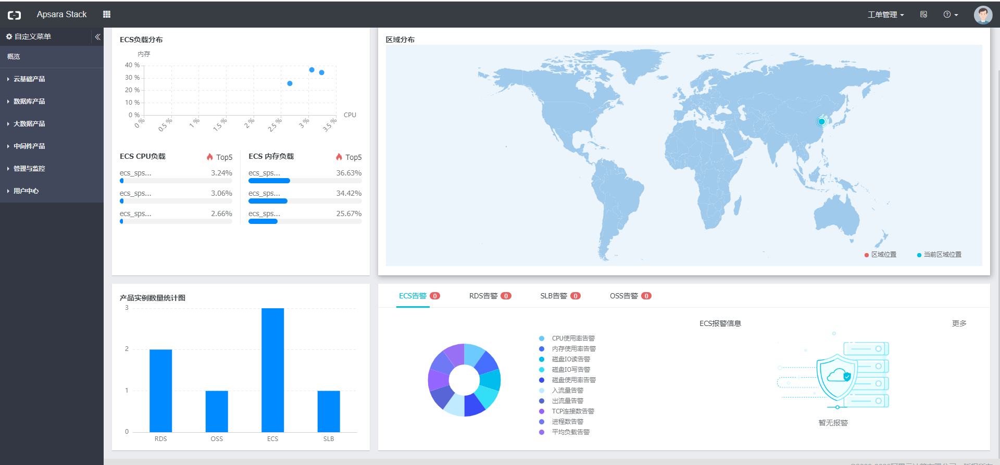
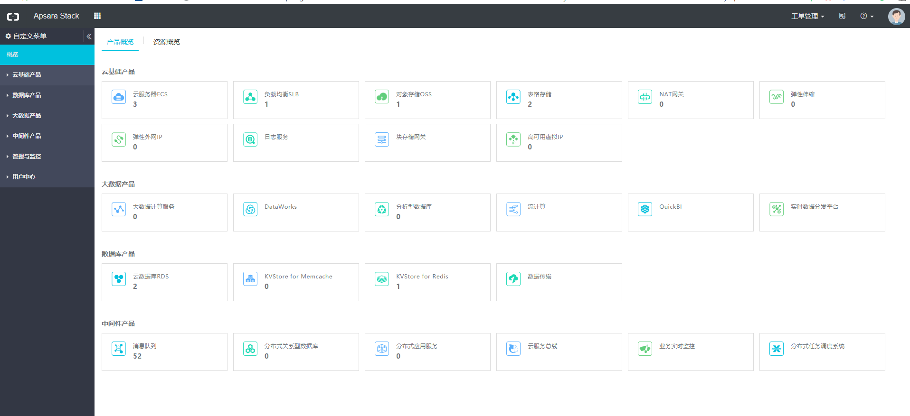
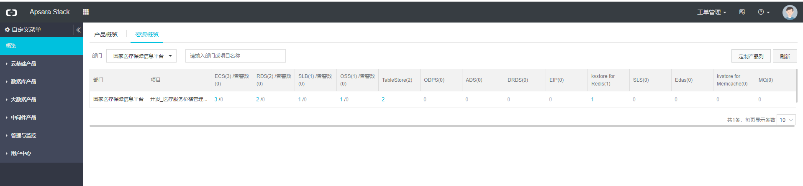
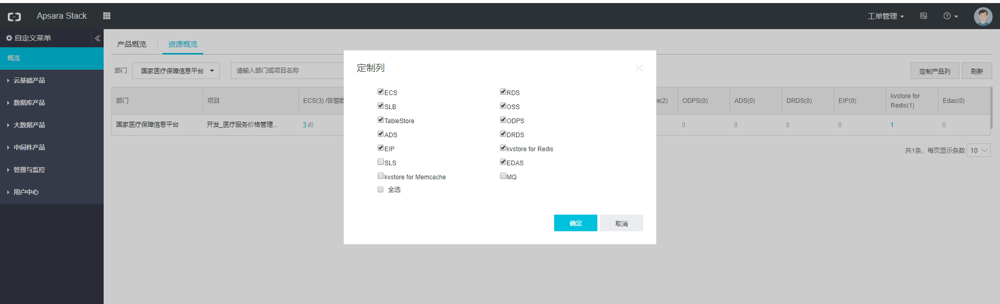
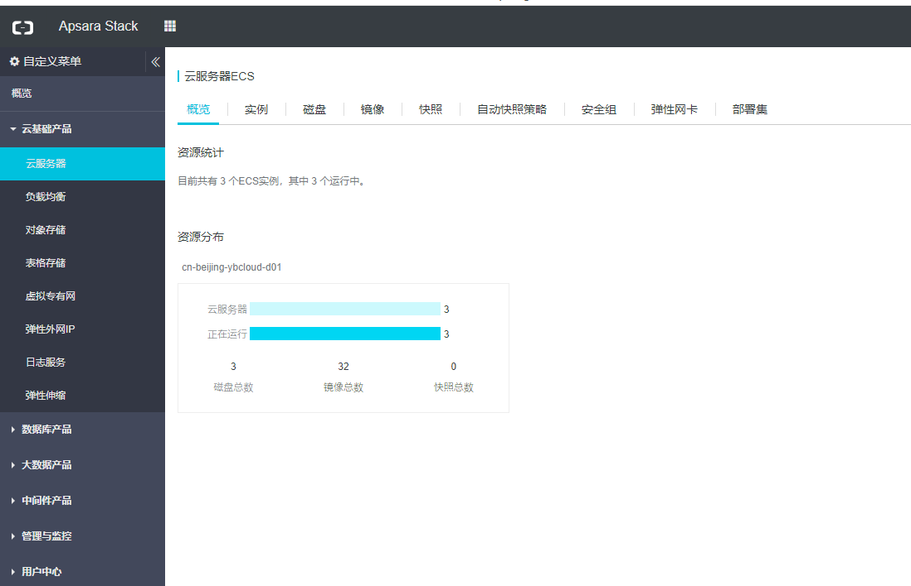
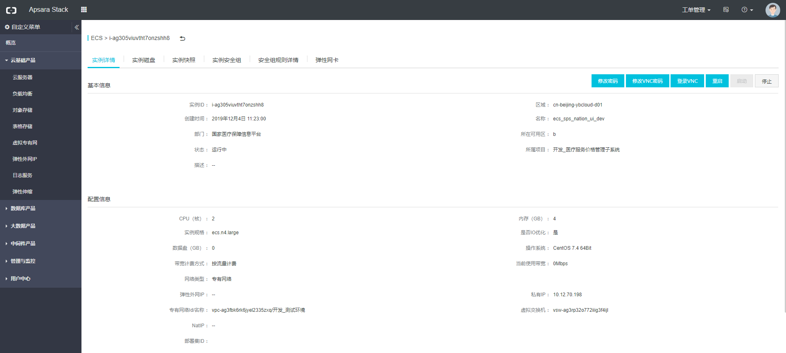
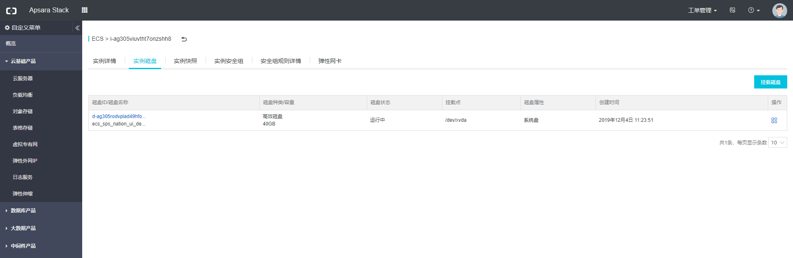
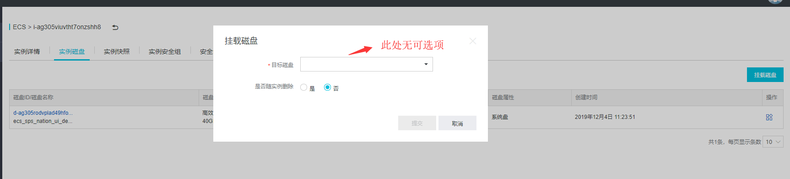

[TOC]

# 首页

# 概览

##  产品概览

##  资源概览

其中【定制产品列】可以自定义显示的列，取消勾选之后，下层列表将会排除掉对应的列

# 云基础产品

## 云服务器

### 概览

概览中显示了云服务器的数量，整体运行情况

### 实例

实例tab页展示了所有当前账户能访问到的实例信息列表，同事支持【定制列】按钮进行自定义显示列，可对服务器进行重启、停止等操作

点击对应云服务器实例的【监控】则跳转到监控中心，可查看监控信息

#### 实例详情

点击实例主页的实例ID或者操作中的【查询详情】可以进入实例详情页面，里面只是了实例的基本所属信息和配置(包括网络)信息

#### 实例磁盘

点击【实例磁盘】tab页可以查看实例的磁盘信息

点击【挂载磁盘】可以进行磁盘的挂载

